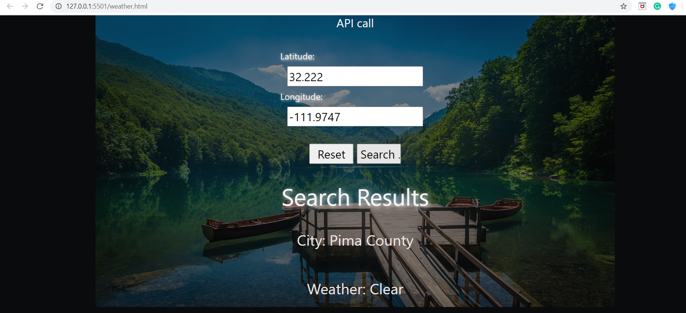

# Weather RESTful API Application

https://srujanks1995.github.io/Weather-Application/index.html

Get Weather update based on Latitude and Longitude.
Application gets data form REST API

Javascript,

HTML,

CSS,

jQuery,

AJAX,

REST API,

JSON

